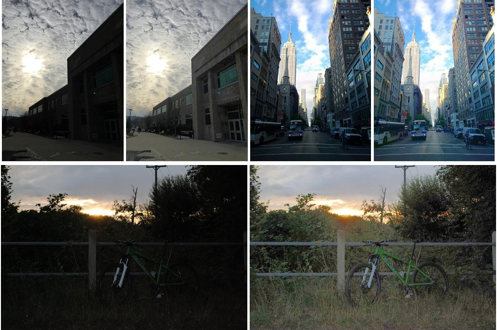

# Backlit and Low-light Image Enhancement
via Region-based Histogram and Fusion (RBHF)
% Developed By Shaffa K. Kokro Jr., 16th October 2021
% MSc. research supervised by Prof. Elijah Mwangi 
% And Dr. George Kamucha
% Department of Electrical & Information Engineering
% University of Nairobi

## About
The proposed RBHF technique enhances a single backlit or low-light image
Using region-based histogram specification & DWT image fusion. The algorithm corrects exposure disparities in captured photos and results in no colour distortion or artefacts. Multiple iterations can improve enhancement quality, significantly. Unsharp masking can be applied to the final output to sharpen image.

## Enhancement results

Examples here shown at low resolution.

Simulation results - Google Drive:
[link](https://drive.google.com/drive/folders/1j2nIyDCAfHpSuQhMeq0uhxcdnH3hOqJ9?usp=sharing)
